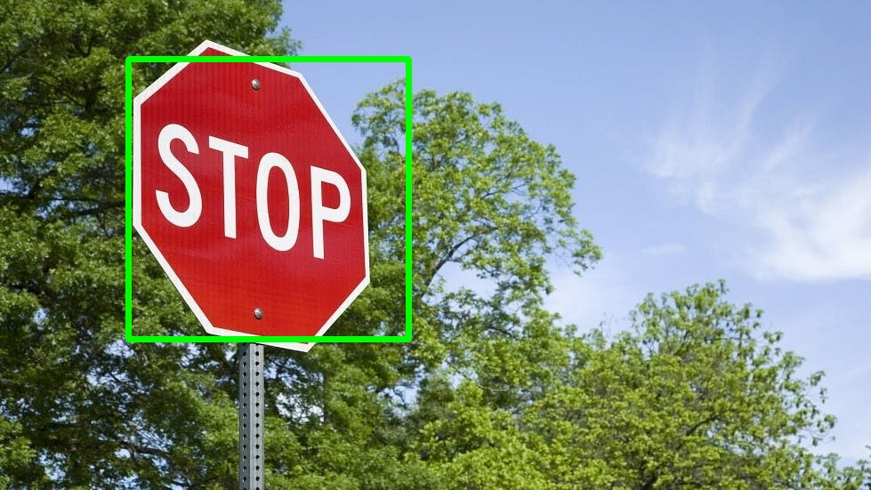
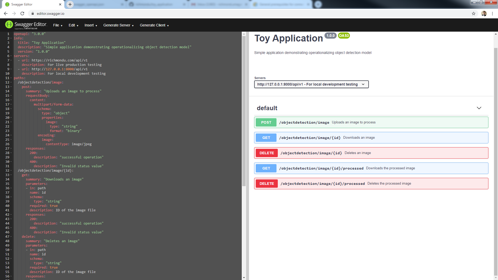

# Toy Application 

This is a simple exercise demonstrating serving APIs for object detection.

# Requirements

### Background:

The software team is currently focused on developing applications for machine vision related products. 
The applications are meant to be deployed at client sites. 
However, as part of marketing efforts, parallel versions of the applications are deployed on the cloud to help the company reach a larger audience and expand the client base.

### The challenge:

At the heart of many machine vision solutions is a software package named OpenCV. 
In order to test applicant adaptability to one of many software packages used by the team, this challenge involves a toy backend application.

Create a simple toy backend that can be tested using CURL or Postman that will integrate a simple openCV application. 
The API endpoint or endpoints must handle all the inputs required by the application. 
Link to the openCV application can be found here: https://www.geeksforgeeks.org/detect-an-object-with-opencv-python/

### Submission Guidelines:

- Package the submission as a container project.

- Submit this toy application marked as a private repo in a git repository.

- Be ready to show a good working demo.

- Feel free to discuss any detail related to the task prior to submission.

- Stretch Goals (optional):

    - Expose a swagger UI of your backend endpoints.

    - Design it to scale for hundreds of requests per second

- Questions:

    - Please walk us through your solution and explain your approach

    - Why did you take this approach?

    - If you were to complete the stretch goals, what would be your approach and what steps would you take?

    - What are the issues you think the team would encounter in relation to the development of machine vision products?

    - How would you solve these issues?

# Design

This solution uses </b>microservices architecture</b> instead of using serverless architecture for better control and flexibility - can run anywhere, any cloud, not tied up to AWS.
Currently, there are only 2 containers - REST API microservice and NGINX microservice.

- It uses the following tech stack:

    - <b>Flask</b> - for API development
    - <b>gUnicorn</b> - for WSGI server; refer to toy_application\restapi\src\wsgi.py
    - <b>Docker</b> - for microservice containerization
    - <b>Docker-compose</b> - for building and running the docker containers; refer to toy_application\docker-compose.yml
    - <b>Nginx</b> - web server for API server, SSL offloading (and load balancing when using multiple nodes); refer to toy_application\nginx
    - <b>unittest</b> - for API unit testing
    - <b>curl</b> - for API system testing
    - <b>Swagger OpenAPI</b> - for API documentation
    - <b>AWS EC2</b> - for running the containers, uses Amazon Linux AMI 2 OS
    - <b>AWS Route53</b> - for routing richmondu.com to the EC2 instance
    - <b>GoDaddy</b> - for certificates for richmondu.com

- Automated build and deployment is setuped using Jenkins pipeline:

    - <b>Jenkins</b> - for automated build and deployment (CI/CD); refer to toy_application\Jenkinsfile
    - <b>Github</b> - for source code repository

    - Jenkins has been setuped to download from get code from Github and then build and deploy to AWS EC2.
      

- Below are the APIs:

    - <b>Upload image</b> POST /api/v1/objectdetection/image
    - <b>Download image</b> GET /api/v1/objectdetection/image/{id}
    - <b>Download processed image</b> GET /api/v1/objectdetection/image/{id}/processed

    - To view using <b>Swagger UI</b>, go to https://petstore.swagger.io/, then use https://hacarustoyapplication.s3.amazonaws.com/swagger_openapi.json and click Explore.
      

# Testing

### System testing

via <b>Swagger UI</b> (https://petstore.swagger.io/)

- Copy https://hacarustoyapplication.s3.amazonaws.com/swagger_openapi.json to the Swagger UI Explore input

- Click on Explore button

- Select http://127.0.0.1:8000 localhost or https://richmondu.com

- Test Upload image 

    (Click Try it out -> Click Choose File button -> Select file to upload ex. image.jpg -> Click Execute -> Response should be ok)

- Test Download image 

    (Click Try it out -> Click Choose File button -> Select file to upload ex. image.jpg -> Click Execute -> Response should be ok)

- Test Download processed image 

    (Click Try it out -> Click Choose File button -> Select file to upload ex. image.jpg -> Click Execute -> Response should be ok)

  

via <b>Swagger Editor</b> (https://editor.swagger.io/)

- Copy https://hacarustoyapplication.s3.amazonaws.com/swagger_openapi.yaml to the Swagger Editor 

- Select http://127.0.0.1:8000 localhost or https://richmondu.com

- Test Upload image 

    (Click Try it out -> Click Choose File button -> Select file to upload ex. image.jpg -> Click Execute -> Response should be ok)

- Test Download image 

    (Click Try it out -> Click Choose File button -> Select file to upload ex. image.jpg -> Click Execute -> Response should be ok)

- Test Download processed image 

    (Click Try it out -> Click Choose File button -> Select file to upload ex. image.jpg -> Click Execute -> Response should be ok)

  

via <b>test_curl_upload.bat</b>

- This uses the images in <b>test_images\input</b>
- curl -X POST http://127.0.0.1:8000/api/v1/objectdetection/image -F "image=@image.jpg" 
- curl -X POST http://127.0.0.1:8000/api/v1/objectdetection/image -F "image=@image__blur4.0.jpg" 
- curl -X POST http://127.0.0.1:8000/api/v1/objectdetection/image -F "image=@image__fliph.jpg" 
- curl -X POST http://127.0.0.1:8000/api/v1/objectdetection/image -F "image=@image__rot180.jpg" 
- curl -X POST http://127.0.0.1:8000/api/v1/objectdetection/image -F "image=@image__zoom200_0_300_300.jpg" 

  

via <b>test_curl_download.bat</b>

- This downloads the processed images in <b>test_images\output</b>
- curl -o image.jpg http://127.0.0.1:8000/api/v1/objectdetection/image/image.jpg/processed
- curl -o image__blur4.jpg http://127.0.0.1:8000/api/v1/objectdetection/image/image__blur4.jpg/processed
- curl -o image__fliph.jpg http://127.0.0.1:8000/api/v1/objectdetection/image/image__fliph.jpg/processed
- curl -o image__rot180.jpg http://127.0.0.1:8000/api/v1/objectdetection/image/image__rot180.jpg/processed
- curl -o image__zoom200_0_300_300.jpg http://127.0.0.1:8000/api/v1/objectdetection/image/image__zoom200_0_300_300.jpg/processed

  

### Unit testing

test.py

- Test the logic

- uses <b>test_images/input/*</b>

  Augmentation was done on image.jpg to produced several images (rotated, blurred, flipped, transformed, etc)

- outputs result to <b>test_images/output/*</b>

  Same filename as in input

test_api.py

- Test the APIs

# Points for improvement:

1. <b>File name conflicts</b>

   Generating ids instead of filename as id will prevent conflicts from multiple users.
   Adding user sessions will also prevent that issue from occuring.

2. <b>File storage</b>

   Copy data to Amazon S3 not in local file system. 
   Currently, everything is stored in the file system.

3. <b>Performance</b>

   Use FastAPI with uvicorn (instead of Flask with gUnicorn) for faster performance (with async/await for concurrency).
   Caching for images processed using Redis database will also help so that processed images no need to be processed again.

4. <b>Reliability and robustness</b>

   Separate actual detection to another container microservice to handle big files that may require more time to process.
   Use a message broker like RabbitMQ to pass information.
   For this demo, adding bounded box for the images just takes less than 35 milliseconds (so to add a broker is currently an overkill but definitely needed when requirement becomes more complex)

5. <b>Scalability and High-availability</b>

   Use AWS Elastic Load Balancer that points to an Auto Scaling Group of more than 1 EC2 instance located in multi-AZ availability zones for scalability and high availability
   Can alternatively use Docker Swarm or Kubernetes (not is not recommended now since there are only 2 containers).

